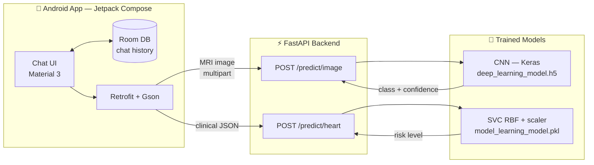

<div align="center">


<h3>Dual-model medical AI for brain tumor MRI classification and cardiovascular risk assessment</h3>

<p>
  <a href="#-architecture">Architecture</a> ·
  <a href="#-models">Models</a> ·
  <a href="#-getting-started">Getting Started</a> ·
  <a href="#-api-reference">API</a>
</p>

<p>
  
  
  
  
  
  
</p>

</div>

---

## Overview

**NeuroCardiac** is an end-to-end medical AI system that pairs two independent diagnostic models behind a single mobile interface.

A **convolutional neural network** classifies brain MRI scans into four tumor categories, and a **support vector classifier** estimates heart disease risk from ten routine clinical measurements. Both are served by an async FastAPI backend and consumed by a native Android app built entirely in Jetpack Compose, where each model has its own persistent chat thread.

> [!IMPORTANT]
> This project is built for academic and research purposes. It is **not** a certified medical device and must not be used for clinical diagnosis or treatment decisions.

<br>

## 🏛 Architecture



Both endpoints run their inference call inside `asyncio.to_thread`, so a slow prediction never blocks the event loop.

<br>

## 📂 Repository Structure

```
NeuroCardiac/
├── NeuroCardiacAiModels/            # Model training (exported Colab notebooks)
│   ├── deep_learning_model.py       # CNN — brain tumor MRI classification
│   └── machine_learning_model_.py   # 10-classifier benchmark — heart disease
│
├── NeuroCardiacBackend/             # Inference API
│   ├── main.py                      # FastAPI app, both endpoints
│   ├── requirements.txt             # Pinned dependencies
│   ├── .env.example                 # Configuration template
│   └── models/
│       ├── model_learning_model.pkl # SVC + scaler (committed)
│       └── deep_learning_model.h5   # CNN weights (see note below)
│
└── NeuroCardiacAndroidApp/          # Android client
    ├── app/src/main/java/com/example/neurocardiac/
    │   ├── MainActivity.kt          # Entry point
    │   ├── AiChatScreen.kt          # Compose UI + clinical form dialog
    │   ├── AiChatViewModel.kt       # State, prediction calls, image handling
    │   ├── AiModelApi.kt            # Retrofit interface + DTOs
    │   └── AppDatabase.kt           # Room entity, DAO, database
    └── design_assests/              # Logo source files (SVG / AI)
```

<br>

## 🧠 Models

### Brain Tumor Classification — CNN

A sequential convolutional network trained from scratch on labelled brain MRI scans, distinguishing **Glioma**, **Meningioma**, **No Tumor**, and **Pituitary**.

| Property | Value |
|:---|:---|
| Input shape | `299 × 299 × 3` |
| Convolutional blocks | 3 × (`Conv2D` → `MaxPooling2D`), filters 32 → 64 → 128 |
| Classifier head | `Flatten` → `Dense(128, relu)` → `Dropout(0.5)` → `Dense(4, softmax)` |
| Optimizer | Adam |
| Batch size | 32 |
| Max epochs | 50, with early stopping |
| Early stopping | `monitor='val_loss'`, `patience=5`, `restore_best_weights=True` |
| Augmentation | Rescale `1/255`, brightness range `0.8–1.2` |
| Validation split | 15% held out from the training set |

Training and validation generators apply augmentation; the test generator applies normalization only, so evaluation runs against unmodified images. Performance is assessed on a held-out test set using a classification report and confusion matrix across all four classes.

### Heart Disease Risk — SVC

Rather than assuming a model, the training script benchmarks **ten classifiers** on the same preprocessed data — Logistic Regression, Linear SVM, RBF SVC, Decision Tree, Random Forest, Gradient Boosting, KNN, XGBoost, Naive Bayes, and Bagging.

Each is evaluated twice: once on a held-out test split, and again under **stratified k-fold cross-validation** with per-fold accuracy and recall recorded. Recall carries real weight here — a false negative means telling an at-risk patient they are fine. The **RBF-kernel SVC** (`C=1.0`, `gamma='scale'`) was selected from that comparison and exported alongside its fitted scaler.

**Preprocessing pipeline:**

1. Drop duplicate rows; impute missing `MaxHR` with the column mean
2. One-hot encode `Sex` and `ExerciseAngina` (`drop_first=True`)
3. Label encode `ChestPainType` and `ST_Slope`
4. Drop `RestingECG`
5. 80/20 train-test split (`random_state=42`)
6. Scale all features with `MinMaxScaler`

The model and its scaler are serialized together in a single dictionary, so inference-time scaling always matches training exactly:

```python
joblib.dump({'model': svc_cv, 'scaler': scaler}, 'heart_disease_svc_model.pkl')
```

> [!NOTE]
> The training script writes `heart_disease_svc_model.pkl`. The backend loads this file as `models/model_learning_model.pkl` — rename it when deploying a newly trained model.

<br>

## 🚀 Getting Started

### Prerequisites

| Component | Requirement |
|:---|:---|
| Backend | Python 3.10+ |
| Android | Android Studio, JDK 17, device or emulator on API 29+ |
| Training | Google Colab or a local Jupyter environment |

### 1 · Backend

```bash
cd NeuroCardiacBackend

python -m venv .venv
source .venv/bin/activate          # Windows: .venv\Scripts\activate

pip install -r requirements.txt

cp .env.example .env               # adjust paths/port if needed
python main.py
```

The API starts on `http://0.0.0.0:8000`. Interactive Swagger docs are available at **`http://localhost:8000/docs`**.

> [!WARNING]
> **The CNN weights are not committed to this repository.** `models/deep_learning_model.h5` exceeds practical Git file limits, so the brain tumor endpoint will fail until you supply it. Run `NeuroCardiacAiModels/deep_learning_model.py` to train the network, then save the result to `NeuroCardiacBackend/models/deep_learning_model.h5`. The heart disease model ships with the repo and works immediately.

### 2 · Android App

Open `NeuroCardiacAndroidApp/` in Android Studio and let Gradle sync.

The API base URL is read from Gradle rather than hardcoded. Set it in `local.properties` (kept out of version control) or `gradle.properties`:

```properties
# Emulator reaching a server on the host machine
NEUROCARDIAC_BASE_URL=http://10.0.2.2:8000/

# Physical device on the same Wi-Fi — use your machine's LAN IP
# NEUROCARDIAC_BASE_URL=http://192.168.1.4:8000/
```

Then build and run. The app requires only `INTERNET` permission; MRI images are selected through the system picker and copied to app-internal storage.

> [!TIP]
> A physical device cannot reach `localhost` or `10.0.2.2` — those resolve to the phone itself. Use your computer's LAN IP and confirm both devices are on the same network. `usesCleartextTraffic` is enabled to permit plain HTTP during local development.

### 3 · Training the Models

Both scripts in `NeuroCardiacAiModels/` are Colab notebook exports and expect a Colab runtime for their upload and download cells.

- **`deep_learning_model.py`** — upload an MRI archive containing `Training/` and `Testing/` directories, one subfolder per class.
- **`machine_learning_model_.py`** — expects `heart.csv` with columns: `Age`, `Sex`, `ChestPainType`, `RestingBP`, `Cholesterol`, `FastingBS`, `RestingECG`, `MaxHR`, `ExerciseAngina`, `Oldpeak`, `ST_Slope`, `HeartDisease`.

Datasets are not included in this repository.

<br>

## 📡 API Reference

### `POST /predict/image`

Classifies a brain MRI scan. Accepts `multipart/form-data`; non-image content types are rejected with `400`.

**Request**

```bash
curl -X POST http://localhost:8000/predict/image \
  -F "file=@scan.jpg"
```

**Response** · `200 OK`

```json
{
  "prediction": "Meningioma",
  "confidence": 97.34,
  "filename": "scan.jpg"
}
```

`confidence` is the softmax probability of the winning class, as a percentage rounded to two decimals.

---

### `POST /predict/heart`

Assesses cardiovascular risk from clinical measurements. Values are validated by Pydantic before reaching the model.

**Request**

```bash
curl -X POST http://localhost:8000/predict/heart \
  -H "Content-Type: application/json" \
  -d '{
    "Age": 54, "Sex": "M", "ChestPain": "ATA",
    "RestingBP": 130, "Cholesterol": 246, "FastingBS": "No",
    "MaxHR": 150, "ExAngina": "No", "Oldpeak": 1.2, "ST_Slope": "Flat"
  }'
```

**Field reference**

| Field | Type | Accepted values / range |
|:---|:---|:---|
| `Age` | int | 1 – 120 |
| `Sex` | string | `M` / `Male` / `1` → male, anything else → female |
| `ChestPain` | string | `ASY`, `ATA`, `NAP`, `TA` |
| `RestingBP` | int | 0 – 300 mm Hg |
| `Cholesterol` | int | 0 – 600 mg/dl |
| `FastingBS` | string | `Yes` / `Y` / `1` → true, else false |
| `MaxHR` | int | 60 – 220 bpm |
| `ExAngina` | string | `Yes` / `Y` / `1` → true, else false |
| `Oldpeak` | float | −5.0 – 10.0 |
| `ST_Slope` | string | `Up`, `Flat`, `Down` |

**Response** · `200 OK`

```json
{
  "prediction": "High Risk of Heart Disease",
  "confidence": 0.0,
  "filename": "Clinical Assessment"
}
```

`prediction` is either `High Risk of Heart Disease` or `Low Risk`. The `confidence` field is `0.0` — the SVC is fitted without `probability=True`, so no calibrated score is available for this endpoint.

<br>

## 📱 Android Client

A single-activity Compose app with two independent chat threads, switched by a toggle in the top bar.

| Layer | Implementation |
|:---|:---|
| UI | Jetpack Compose, Material 3 |
| State | `AIChatViewModel` exposing `StateFlow` per model |
| Persistence | Room — `ChatMessage` entity, separate history per `modelType` |
| Networking | Retrofit 3 + Gson, `suspend` functions on `AiModelApi` |
| Images | Coil for rendering, `FileProvider` for camera capture |

**Brain tumor thread** — pick or capture an MRI scan. The image is copied to internal storage so history survives across sessions, uploaded as a multipart part, and the diagnosis returns as a chat bubble.

**Heart disease thread** — a dialog collects the ten clinical fields. `validateInputs` parses and range-checks the numeric entries before any network call, and the submitted values are echoed into the thread as a summary alongside the assessment.

Chat history is queried as a `Flow` and persists across app restarts.

<br>

## 🛠 Tech Stack

<table>
<tr><td><b>Deep Learning</b></td><td>TensorFlow · Keras · Pillow · NumPy</td></tr>
<tr><td><b>Machine Learning</b></td><td>scikit-learn · XGBoost · pandas · joblib</td></tr>
<tr><td><b>Analysis</b></td><td>Matplotlib · Seaborn</td></tr>
<tr><td><b>Backend</b></td><td>FastAPI · Uvicorn · Pydantic</td></tr>
<tr><td><b>Android</b></td><td>Kotlin · Jetpack Compose · Material 3 · Room · Retrofit · Coil</td></tr>
<tr><td><b>Build</b></td><td>Gradle Kotlin DSL · KSP · Java 17</td></tr>
</table>

<br>

## 🗺 Roadmap

- [ ] Calibrated probability output for the heart disease endpoint (`probability=True`)
- [ ] Grad-CAM overlays highlighting the MRI regions driving each classification
- [ ] Health check and model-status endpoints
- [ ] Containerized backend deployment
- [ ] Export results as a shareable report from the app

<br>

## ⚕️ Disclaimer

NeuroCardiac is a student research project. Its predictions are statistical estimates produced by models trained on public datasets, and they carry no clinical validation, regulatory approval, or guarantee of accuracy. **Nothing this system outputs should inform a real medical decision.** Always consult a qualified healthcare professional.

<br>

---

<div align="center">
<sub>Built with FastAPI, TensorFlow, and Jetpack Compose</sub>
</div>
